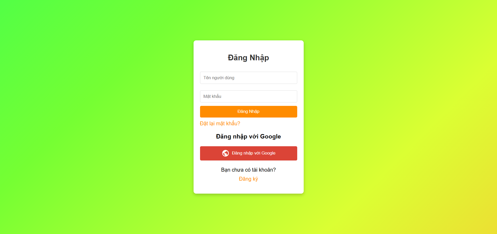
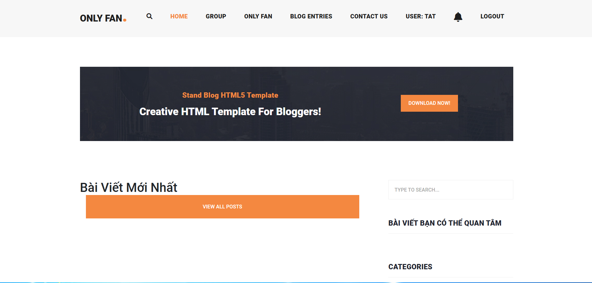
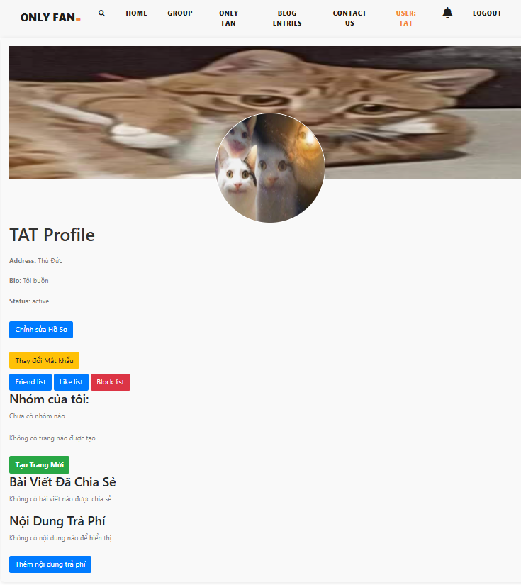
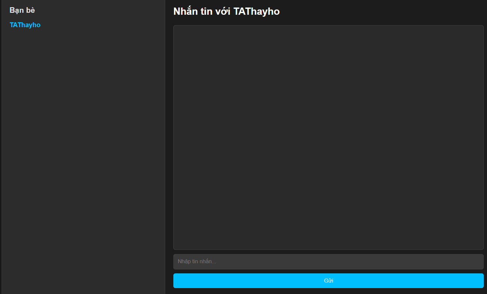

# Project Social Media

<h2 align="center">Hello 👋, I'm Tuan</h2>

  I'm a student at <a href="https://el.tdc.edu.vn/" target="_blank">Thu Duc College of Technology (TDC)</a>.

 

## 📫 How to Reach Me

   
   
  

## 🛠️ Skills

  
  
  
  
  
  
  
  

## Introduce the project:

Dự án của tôi là dự án làm về một mạng xã hội nơi mà người dùng có thể chia sẽ những gì bản thân muốn và đăng bán tài năng của bản thân

## Features:
- Đăng ký tài khoản
- Tạo, sửa, xóa profile người dùng với thông tin cá nhân
- Ảnh đại diện và ảnh bìa
- Giới thiệu và cập nhật trạng thái
- Đăng nhập và Đăng xuất
- Khôi phục mật khẩu
- Xác thực và ủy quyền người dùng
- Đổi mật khẩu
- Khôi phục mật khẩu với OTP
- Khóa tài khoản
- Tìm bạn
- Hủy kết bạn
- Danh sách bạn
- Chấp nhận hoặc từ chối lời mời kết bạn
- Tìm kiếm bạn bè
- Chặn bạn
- Danh sách bạn đã chặn
- Hủy chặn bạn
- Tạo, sửa, xóa trang
- Tạo, sửa, xóa bài viết trên trang
- Thích hoặc hủy thích trang
- Thích bài viết
- Lịch sử thích và hủy thích bài viết
- Phản ứng với bài viết
- Hủy phản ứng với bài viết
- Chia sẻ bài viết trên tường hoặc dòng thời gian của người dùng
- Chọn chế độ xem bài viết (công khai, bạn bè, chỉ mình,..)
- Tạo, sửa, xóa nhóm
- Tham gia nhóm
- Rời khỏi nhóm
- Duyệt hoặc hủy duyệt thành viên nhóm
- Thông báo thời gian thực cho lời mời kết bạn
- Cập nhật lượt thích bài viết, trang thời gian thực
- Thông báo Email OTP 
- Theo dõi người dùng khác
- Hủy theo dõi người dùng
- Danh sách thành viên nhóm
- ủy quyền nhóm
- Đề xuất bạn bè
- Tạo, sửa, xóa bài viết trong nhóm
- Tạo, sửa, xóa bình luận
- Tạo, sửa, xóa trả lời bình luận
- Hiển thị danh sách bài viết theo thứ tự thời gian từ bạn bè/người dùng được theo dõi
- Xếp hạng feed bằng thuật toán
- Gửi tin nhắn đến bạn bè
- Cập nhật thời gian thực khi gửi và xóa tin nhắn
- Tạo, sửa, xóa bài viết trên trang cá nhân
- Thêm thẻ bạn bè vào bài viết
- Xóa thẻ bạn bè khỏi bài viết
- Chấp nhận/từ chối thẻ bạn bè từ yêu cầu
- Xóa bình luận của bạn bè trên bài viết
- Thích bình luận
- Tạo bình luận với hình ảnh
- CRUD nội dung trả phí
- Mua nội dung trả phí
- Thông báo Email nội dung trả phí  
- Phân trang cho bài viết
- Chức năng tìm kiếm bài viết

## Installation guide:

Đây là các module cần thiết để khởi chạy dự án

- pip install Django
- pip install Faker
- pip install bcrypt
- pip install django[argon2] 
- pip install Pillow
- pip install django-environ
- pip install django-ckeditor-5
- pip install django-allauth
- pip install django_extensions
- pip install django_requests
- pip install jwt
- pip install social_auth_app_django
- pip install channels
- pip install channels-redis
- pip install redis
- pip install daphne

## User guide:

Để xem và sử dụng tất cả các chức năng của trang web user có thể tự tạo tài khoản để trại nghiêmj

## Project Demo:
- Trang đăng nhập:

- Trang Chính:

- Profile User:

- Messages:

- Còn nhiều nội dung khác vẫn còn chưa hiện hết.

